# 🚀 CodeHub (CodeHubX) — Complete Project Documentation

> **A full-stack competitive coding & placement preparation platform built with React, Node.js, MongoDB, Redis, and Docker.**

---

## 📋 Table of Contents

1. [Project Overview](#-project-overview)
2. [Technology Stack](#-technology-stack)
3. [Architecture Diagram](#-architecture-diagram)
4. [Frontend Architecture](#-frontend-architecture)
5. [Backend Architecture](#-backend-architecture)
6. [Database Design (MongoDB)](#-database-design-mongodb)
7. [Redis Cache System](#-redis-cache-system)
8. [Docker Containerization](#-docker-containerization)
9. [Code Execution Engine (Judge0)](#-code-execution-engine-judge0)
10. [AI Integration (Multi-Provider)](#-ai-integration-multi-provider)
11. [Authentication & Security](#-authentication--security)
12. [Payment System (Razorpay)](#-payment-system-razorpay)
13. [Certificate Generation](#-certificate-generation)
14. [Company Preparation Module](#-company-preparation-module)
15. [Admin Panel](#-admin-panel)
16. [Deployment & DevOps](#-deployment--devops)
17. [API Routes Reference](#-api-routes-reference)
18. [Environment Variables](#-environment-variables)
19. [Key Features Summary](#-key-features-summary)

---

## 🌐 Project Overview

**CodeHub (CodeHubX)** is a comprehensive coding practice and placement preparation platform designed for students and developers. It provides:

- An **online code editor** supporting JavaScript, Python, C++, and Java
- **DSA problem sets** with structured roadmaps
- **Company-specific preparation** (TCS, Infosys, Wipro, etc.)
- **AI-powered hints and explanations** via multi-provider failover
- **Subscription-based monetization** with Razorpay payment gateway
- **Certificate generation** with QR code verification
- A full **Admin Panel** for managing the platform

**Live URL:** `https://codehubx.in`

---

## 🛠 Technology Stack

### Frontend

| Technology | Version | Purpose |
|---|---|---|
| **React** | 19.2.0 | UI framework (SPA) |
| **Vite (Rolldown)** | 7.2.5 | Build tool & dev server |
| **TailwindCSS** | 4.1.18 | Utility-first CSS styling |
| **React Router DOM** | 7.12.0 | Client-side routing |
| **Framer Motion** | 12.30.0 | Animations & transitions |
| **Monaco Editor** | 4.7.0 | Code editor (VS Code engine) |
| **Firebase** | 12.7.0 | Authentication (Google OAuth, Email/Password) |
| **Axios** | 1.13.4 | HTTP client for API calls |
| **Three.js / React Three Fiber** | 0.183.1 / 9.5.0 | 3D graphics on landing page |
| **Lucide React** | 0.562.0 | Icon library |
| **React Hot Toast** | 2.6.0 | Toast notifications |
| **React Markdown** | 10.1.0 | Markdown rendering |
| **HTML React Parser** | 5.2.17 | Parse HTML content |
| **Radix UI Tabs** | 1.1.13 | Accessible tab components |
| **clsx + tailwind-merge** | — | Conditional CSS class merging |

### Backend

| Technology | Version | Purpose |
|---|---|---|
| **Node.js** | 20 (Alpine) | Server runtime |
| **Express** | 5.2.1 | Web framework |
| **MongoDB (Mongoose)** | 9.1.4 | Primary database |
| **Redis (ioredis)** | 5.9.2 | Caching, rate limiting, queue backend |
| **Bull** | 4.16.5 | Job queue for code submissions |
| **JSON Web Token (JWT)** | 9.0.3 | Admin authentication tokens |
| **bcryptjs** | 3.0.3 | Password hashing |
| **Helmet** | 8.1.0 | HTTP security headers |
| **express-rate-limit** | 8.2.1 | API rate limiting |
| **rate-limit-redis** | 4.3.1 | Redis-backed rate limiting |
| **Razorpay SDK** | 2.9.6 | Payment processing |
| **Nodemailer** | 8.0.1 | Email (OTP, notifications) |
| **Puppeteer** | 24.37.5 | PDF certificate generation |
| **QRCode** | 1.5.4 | QR code generation for certificates |
| **geoip-lite** | 1.4.10 | Geo-location based currency detection |
| **uuid** | 13.0.0 | Unique ID generation |
| **Nodemon** | 3.1.11 | Development auto-restart |

### Infrastructure & DevOps

| Technology | Purpose |
|---|---|
| **Docker** | Containerization (multi-stage builds) |
| **Docker Compose** | Multi-container orchestration |
| **Nginx** | Frontend static file serving & SPA routing |
| **PM2** | Node.js process manager (production) |
| **DigitalOcean** | Backend hosting (VPS) |
| **Render** | Alternative backend hosting |
| **Vercel** | Frontend deployment |
| **Judge0 CE** | Remote code execution engine |
| **Firebase** | Authentication & analytics |
| **Git** | Version control |

---

## 🏗 Architecture Diagram

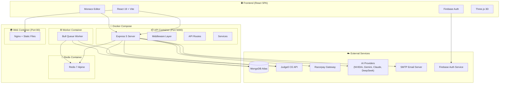

---

## 🎨 Frontend Architecture

### Project Structure

```
src/
├── App.jsx                    # Main app with routing
├── main.jsx                   # Entry point
├── config.js                  # API URL configuration
├── firebase.js                # Firebase initialization
├── index.css                  # Global styles
├── context/
│   └── AuthContext.jsx        # Authentication state management
├── pages/
│   ├── LandingPage.jsx        # Public landing page
│   ├── Login.jsx              # Login/Signup page
│   ├── Dashboard.jsx          # User dashboard
│   ├── QuestionPage.jsx       # Code editor + problem view (155KB!)
│   ├── RoadmapDSA.jsx         # DSA learning roadmap (75KB)
│   ├── CompanyDetail.jsx      # Company-specific prep details
│   ├── CompanyPractice.jsx    # Company practice MCQ module
│   ├── Settings.jsx           # User settings page
│   ├── Profile.jsx            # Public user profile
│   ├── Companies.jsx          # Company listing page
│   ├── Articles.jsx           # Tech articles
│   ├── Pricing.jsx            # Subscription pricing page
│   └── admin/                 # Admin panel pages
│       ├── Dashboard.jsx
│       ├── Problems.jsx       # Problem CRUD (68KB)
│       ├── CompanyQuestions.jsx # Company question CRUD (69KB)
│       ├── UsersManagement.jsx
│       ├── Payments.jsx
│       ├── Announcements.jsx
│       ├── Categories.jsx
│       ├── Settings.jsx
│       ├── SecureAdminLogin.jsx
│       └── SecureAdminPricing.jsx
├── components/
│   ├── Navbar.jsx             # Navigation bar
│   ├── Footer.jsx             # Site footer
│   ├── Hero.jsx               # Landing hero section
│   ├── Features.jsx           # Feature showcase
│   ├── Pricing.jsx            # Pricing cards
│   ├── AnnouncementBar.jsx    # Global announcement banner
│   ├── ErrorBoundary.jsx      # React error boundary
│   ├── LoadingScreen.jsx      # Animated loading screen
│   ├── SubscriptionButton.jsx # Payment trigger button
│   ├── skeletons/             # Loading skeleton components
│   ├── ui/                    # Reusable UI components
│   └── routes/                # Route guards (PublicRoute, ProtectedRoute)
├── services/
│   ├── userService.js         # User API interactions
│   └── aiService.js           # AI API interactions
├── data/
│   ├── articles.js            # Static article content
│   ├── questions.js           # Question metadata
│   └── topics.js              # Topic definitions
└── layouts/
    └── AdminLayout.jsx        # Admin panel sidebar layout
```

### Key Frontend Features

#### 1. **Code Editor (Monaco Editor)**
- VS Code-powered editor with syntax highlighting
- Supports **JavaScript, Python, C++, Java**
- Custom dark theme configuration
- Auto-complete, smooth scrolling, line highlighting
- Editor font: customized with proper styling

#### 2. **Route-Based Code Splitting (Lazy Loading)**
- All pages use `React.lazy()` + `Suspense`
- Reduces initial bundle size significantly
- Only the landing page and navbar are eagerly loaded

#### 3. **Authentication Flow**
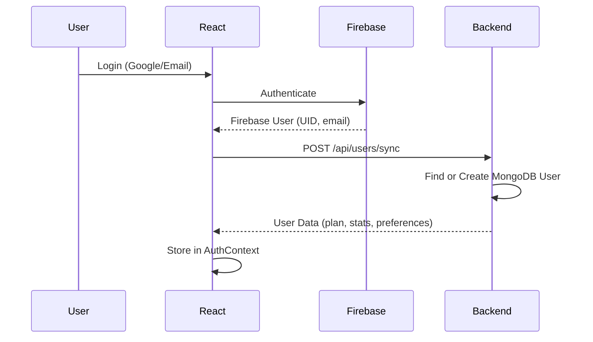

#### 4. **Responsive Design**
- Mobile-responsive with motion reduction on mobile (`MotionConfig`)
- Conditional navbar (hidden on DSA, Admin, Login pages)
- TailwindCSS for responsive utilities

#### 5. **Maintenance Mode**
- Frontend checks `platformSettings.maintenanceMode` from backend
- Non-admin users are redirected to a `<Maintenance />` page
- Admins can still access admin routes and login

---

## ⚙️ Backend Architecture

### Project Structure

```
server/
├── src/
│   ├── server.js               # Entry point (connects DB, starts listening)
│   ├── app.js                  # Express app setup (middleware, routes)
│   ├── config/
│   │   ├── db.js               # MongoDB connection (Mongoose)
│   │   ├── redis.js            # Redis connection + MockRedis fallback
│   │   └── razorpay.js         # Razorpay SDK initialization
│   ├── middleware/
│   │   ├── cache.js            # Redis cache middleware (GET responses)
│   │   ├── rateLimiter.js      # General + strict rate limiters
│   │   ├── requireAdmin.js     # Admin JWT + IP whitelist + CSRF
│   │   ├── geoLocation.js      # GeoIP-based currency detection
│   │   └── verifyWebhook.js    # Razorpay webhook signature verification
│   ├── routes/
│   │   ├── execute.js          # Code run + submission endpoints
│   │   ├── queue.js            # Bull queue job processing
│   │   ├── userRoutes.js       # User CRUD, profile, leaderboard
│   │   ├── problemRoutes.js    # Problem fetching
│   │   ├── adminRoutes.js      # Admin CRUD operations
│   │   ├── adminAuthRoutes.js  # Admin login + OTP verification
│   │   ├── adminPricingRoutes.js # Pricing management
│   │   ├── aiRoutes.js         # AI hint/explanation endpoints
│   │   ├── paymentRoutes.js    # Razorpay order creation
│   │   ├── webhookRoutes.js    # Payment webhooks
│   │   ├── certificateRoutes.js # PDF certificate generation
│   │   ├── announcementRoutes.js # Announcement CRUD
│   │   ├── companyQuestionRoutes.js # Company questions API
│   │   └── platform.js         # Platform settings (maintenance mode)
│   ├── controllers/
│   │   ├── paymentController.js     # Payment logic
│   │   ├── webhookController.js     # Webhook handling
│   │   ├── problemController.js     # Problem business logic
│   │   ├── pricingAdminController.js # Admin pricing management
│   │   └── adminAuthController.js   # Admin auth (login, OTP, session)
│   ├── services/
│   │   ├── aiRouter.js         # Multi-provider AI routing with fallback
│   │   ├── providers.js        # AI provider configurations
│   │   ├── otpService.js       # OTP generation & email sending
│   │   ├── subscriptionService.js # Subscription activation
│   │   ├── pricingService.js   # Price calculation
│   │   └── auditService.js     # Admin action audit logging
│   ├── models/                  # Mongoose schemas (16 models)
│   ├── utils/
│   │   └── judgeHelpers.js     # Judge0 driver code generators (664 lines)
│   └── templates/
│       └── certificate.html    # HTML template for PDF certificates
├── ecosystem.config.js          # PM2 configuration
├── deploy.sh                    # DigitalOcean deployment script
├── Dockerfile                   # Backend Docker image
└── Various seed/test scripts
```

### Middleware Pipeline

```
Request → Helmet → CORS → Cookie Parser → JSON Parser → Rate Limiter → Logger → Route Handler
```

| Middleware | Purpose |
|---|---|
| `helmet()` | Sets secure HTTP headers (XSS, CSP, etc.) |
| `cors({ origin: true, credentials: true })` | Cross-origin cookie support |
| `cookieParser()` | Parse cookies for CSRF and sessions |
| `express.json()` | Parse JSON request bodies |
| `limiter` | Global rate limit: 5,000 req/15 min per IP |
| `strictLimiter` | Sensitive endpoints: 1,000 req/hour per IP |
| [cacheMiddleware(ttl)](file:///c:/Users/prudh/OneDrive/Desktop/CodeHub/CodeHub/server/src/middleware/cache.js#3-43) | Redis-based response caching |
| [requireAdmin](file:///c:/Users/prudh/OneDrive/Desktop/CodeHub/CodeHub/server/src/middleware/requireAdmin.js#4-56) | JWT + IP whitelist + CSRF for admin routes |
| [detectCurrency](file:///c:/Users/prudh/OneDrive/Desktop/CodeHub/CodeHub/server/src/middleware/geoLocation.js#3-32) | GeoIP → INR/USD currency selection |
| [verifyWebhook](file:///c:/Users/prudh/OneDrive/Desktop/CodeHub/CodeHub/server/src/middleware/verifyWebhook.js#3-37) | HMAC-SHA256 signature for Razorpay webhooks |

---

## 🗄 Database Design (MongoDB)

CodeHub uses **MongoDB** (via Mongoose ODM) with **16 collections/models**:

### Core Models

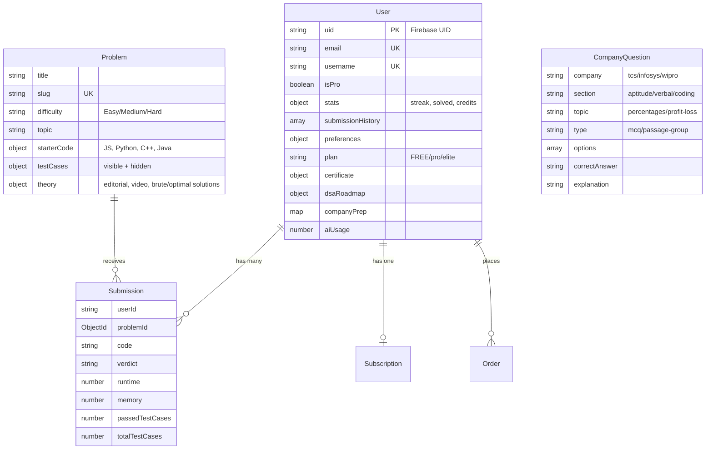

### All 16 Models

| Model | Description | Key Fields |
|---|---|---|
| **User** | User profiles, stats, preferences | `uid`, `email`, [isPro](file:///c:/Users/prudh/OneDrive/Desktop/CodeHub/CodeHub/server/src/services/aiRouter.js#70-76), `stats`, `companyPrep`, `dsaRoadmap`, `certificate` |
| **Problem** | Coding problems with test cases | `title`, `slug`, `difficulty`, `topic`, `starterCode`, `testCases`, `theory` |
| **Submission** | Code submissions per user/problem | `userId`, `problemId`, `code`, `verdict`, `runtime`, `memory` |
| **CompanyQuestion** | MCQ questions for company prep | `company`, `section`, `topic`, `options`, `correctAnswer`, `explanation` |
| **Certificate** | Issued certificates | `certificateId`, `userId`, `name`, `course`, `progress` |
| **Plan** | Subscription plans with pricing | [id](file:///c:/Users/prudh/OneDrive/Desktop/CodeHub/CodeHub/server/src/services/providers.js#74-92), `name`, `monthly_inr_base/offer`, `yearly_usd_base/offer` |
| **Subscription** | Active user subscriptions | `user_id`, `plan_id`, `billing_cycle`, `status`, `start_date`, `end_date` |
| **Order** | Razorpay payment orders | `user_id`, `razorpay_order_id`, `amount`, `currency`, `status` |
| **Payment** | Payment records | Payment transaction data |
| **Offer** | Special pricing offers | Discount and promotion details |
| **Announcement** | Platform-wide announcements | `message`, `type`, `audience`, `bgStyle`, `ctaText`, `ctaLink` |
| **PlatformSettings** | Global settings (singleton) | `maintenanceMode`, `allowRegistrations`, `motd` |
| **AdminUser** | Admin accounts | Admin credentials and roles |
| **AdminSession** | Admin login sessions | Session tracking |
| **AuditLog** | Admin action audit trail | `admin_id`, `action_type`, `entity_type`, `old_value`, `new_value` |
| **Category** | Problem categories | Category metadata |

### Key Database Indexes

- `Submission`: Compound unique index on `{ userId, problemId }` — one submission per problem per user
- `CompanyQuestion`: Compound index on `{ company, section, topic }` — fast topic-level queries
- `CompanyQuestion`: Full-text index on `questionText` — search capability
- [Order](file:///c:/Users/prudh/OneDrive/Desktop/CodeHub/CodeHub/server/src/controllers/paymentController.js#8-77): TTL index on `expireAt` — auto-delete unpaid orders after 15 minutes
- `Announcement`: Compound index on `{ isActive, startAt, endAt, priority }` — efficient active announcement queries

---

## 🔴 Redis Cache System

### Connection Strategy

The Redis configuration ([server/src/config/redis.js](file:///c:/Users/prudh/OneDrive/Desktop/CodeHub/CodeHub/server/src/config/redis.js)) implements a **dual-mode strategy**:

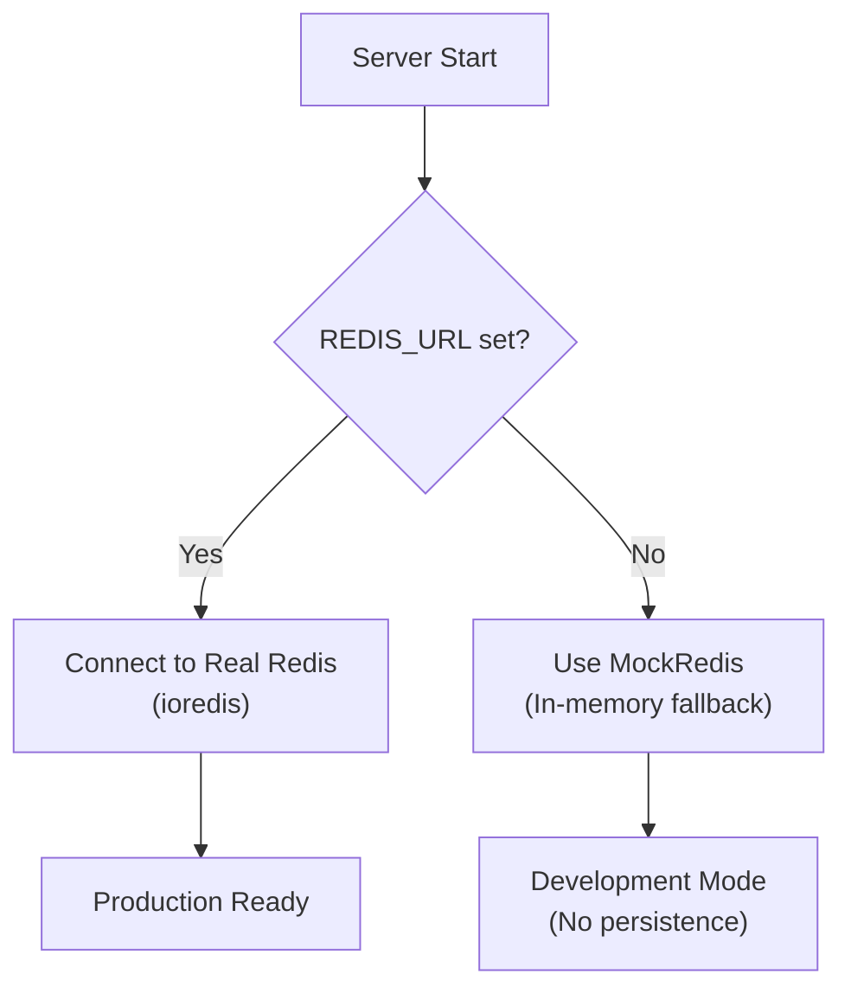

> [!IMPORTANT]
> The **MockRedis** class implements a full in-memory fallback with support for:
> [get](file:///c:/Users/prudh/OneDrive/Desktop/CodeHub/CodeHub/server/src/config/redis.js#16-20), [set](file:///c:/Users/prudh/OneDrive/Desktop/CodeHub/CodeHub/server/src/config/redis.js#21-28), [del](file:///c:/Users/prudh/OneDrive/Desktop/CodeHub/CodeHub/server/src/config/redis.js#29-34), [incr](file:///c:/Users/prudh/OneDrive/Desktop/CodeHub/CodeHub/server/src/config/redis.js#35-41), [expire](file:///c:/Users/prudh/OneDrive/Desktop/CodeHub/CodeHub/server/src/config/redis.js#42-46), [pttl](file:///c:/Users/prudh/OneDrive/Desktop/CodeHub/CodeHub/server/src/config/redis.js#47-52), [zadd](file:///c:/Users/prudh/OneDrive/Desktop/CodeHub/CodeHub/server/src/config/redis.js#53-60), [zremrangebyscore](file:///c:/Users/prudh/OneDrive/Desktop/CodeHub/CodeHub/server/src/config/redis.js#61-69), [zcard](file:///c:/Users/prudh/OneDrive/Desktop/CodeHub/CodeHub/server/src/config/redis.js#70-74), [zrange](file:///c:/Users/prudh/OneDrive/Desktop/CodeHub/CodeHub/server/src/config/redis.js#75-84), [quit](file:///c:/Users/prudh/OneDrive/Desktop/CodeHub/CodeHub/server/src/config/redis.js#85-86), [scanStream](file:///c:/Users/prudh/OneDrive/Desktop/CodeHub/CodeHub/server/src/config/redis.js#87-104), and [pipeline](file:///c:/Users/prudh/OneDrive/Desktop/CodeHub/CodeHub/server/src/config/redis.js#105-122) operations.
> This allows the server to run without Redis installed in development.

### How Redis is Used

| Use Case | Redis Key Pattern | TTL | Description |
|---|---|---|---|
| **Response Caching** | `cache:/api/users/{uid}` | 60s (configurable) | Caches GET API responses to reduce MongoDB load |
| **AI Rate Limiting (Cooldown)** | `ai:cooldown:{uid}` | 3s | 3-second cooldown between AI requests |
| **AI Rate Limiting (Sliding Window)** | `ai:ratelimit:{uid}` | 5 min | Pro users: max 5 AI requests per 5 minutes (sorted set) |
| **AI Provider RPM** | `ai:rpm:{provider}` | 60s | Tracks request count per AI provider (NVIDIA: 40, Gemini: 100, Claude: 50, DeepSeek: 60) |
| **AI Provider Health** | `ai:error:{provider}` | 60-300s | Marks providers as unhealthy after billing/auth/rate errors |
| **Cache Invalidation** | `cache:/api/users/{uid}` | — | Deleted after submission to serve fresh data |
| **Bull Job Queue** | `bull:submission-queue:*` | — | Managed by Bull library for submission processing |

### Cache Middleware Flow

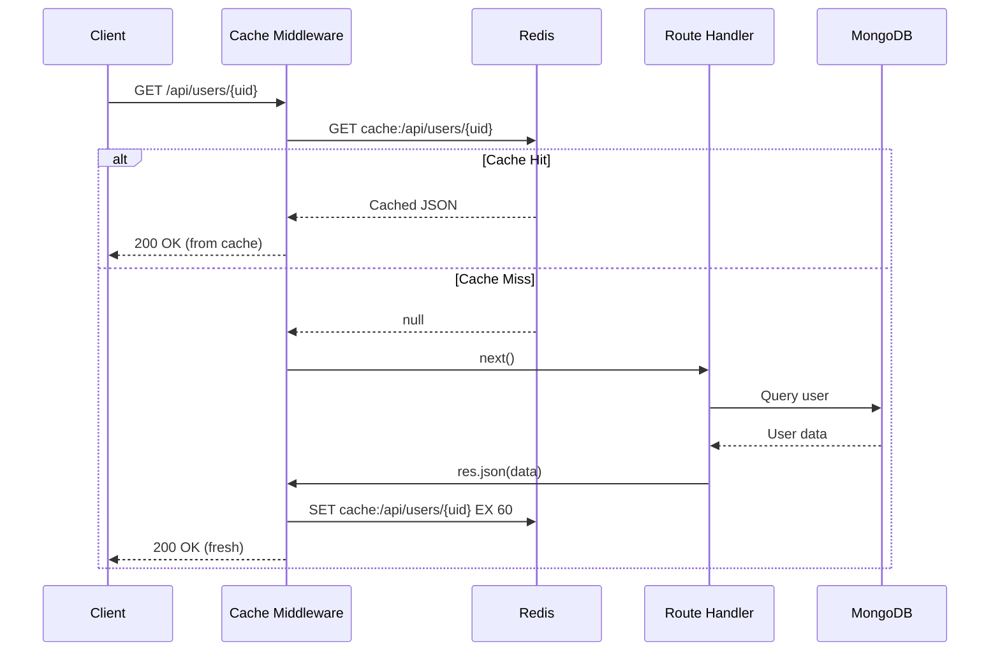

### Cache Invalidation Strategy

After a successful code submission:
```javascript
// Invalidate user cache so next request shows updated stats
await redis.del(`cache:/api/users/${userId}`);
if (userUpdate.username) {
    await redis.del(`cache:/api/users/handle/${userUpdate.username}`);
}
```

---

## 🐳 Docker Containerization

### Docker Compose Architecture (4 Services)

```yaml
# docker-compose.yml — 4 interconnected services
services:
  web:      # Frontend (Nginx serving static React build)
  api:      # Backend (Express API server)
  worker:   # Background job processor (Bull queue consumer)
  redis:    # Redis 7 Alpine (cache, queue, rate limiting)
```

| Service | Image | Port | Purpose | Depends On |
|---|---|---|---|---|
| **web** | Multi-stage: `node:20-alpine` → `nginx:stable-alpine` | `5173:80` | Serves built React SPA via Nginx | — |
| **api** | `node:20-alpine` | `5000:5000` | Express API server | Redis |
| **worker** | `node:20-alpine` (same as API) | — | Bull queue job processor (`node src/worker.js`) | Redis |
| **redis** | `redis:7-alpine` | — (internal) | In-memory data store | — |

### Frontend Dockerfile (Multi-Stage Build)

```dockerfile
# Stage 1: Build
FROM node:20-alpine AS builder
WORKDIR /app
COPY package.json package-lock.json* ./
RUN npm ci --silent || npm install --silent
COPY . .
RUN npm run build

# Stage 2: Serve
FROM nginx:stable-alpine
COPY --from=builder /app/dist /usr/share/nginx/html
COPY nginx.conf /etc/nginx/conf.d/default.conf
EXPOSE 80
CMD ["nginx", "-g", "daemon off;"]
```

> [!TIP]
> The multi-stage build produces a minimal production image. The build stage uses `node:20-alpine` for npm and Vite, but the final image only contains Nginx + static files (~50MB vs ~500MB).

### Backend Dockerfile

```dockerfile
FROM node:20-alpine
WORKDIR /app
COPY package*.json ./
RUN npm install --production
COPY . .
EXPOSE 5000
CMD ["node", "src/server.js"]
```

### Nginx Configuration (SPA Routing)

```nginx
server {
    listen 80;
    server_name _;
    root /usr/share/nginx/html;
    index index.html;

    location / {
        try_files $uri $uri/ /index.html;  # SPA fallback
    }

    location /_next/static/ {
        expires 1y;
        add_header Cache-Control "public";  # Long-term caching for assets
    }
}
```

---

## ⚡ Code Execution Engine (Judge0)

### How Code Execution Works

CodeHub uses **Judge0 Community Edition** (hosted at `https://ce.judge0.com`) for remote code execution with a sophisticated driver code generation system.

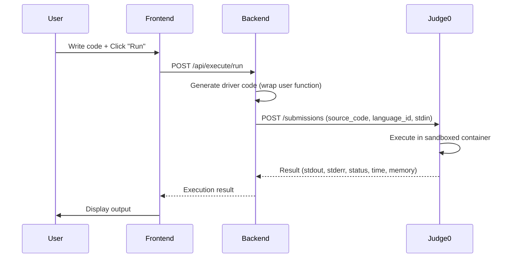

### Supported Languages

| Language | Judge0 ID | Time Limit | Memory Limit |
|---|---|---|---|
| JavaScript (Node.js) | 63 | 2s | 256 MB |
| Python 3 | 71 | 2s | 256 MB |
| C++ (GCC) | 54 | 1s | 256 MB |
| Java (OpenJDK) | 62 | 1.5s | 256 MB |

### Driver Code Generation

The [judgeHelpers.js](file:///c:/Users/prudh/OneDrive/Desktop/CodeHub/CodeHub/server/src/utils/judgeHelpers.js) (664 lines) generates wrapper code that:
1. **Parses user function signatures** (function name, arguments)
2. **Generates driver code** that parses test case inputs and calls the user's function
3. **Formats output** for comparison against expected answers

#### Two Execution Modes:

| Mode | Endpoint | Description |
|---|---|---|
| **Run** | `POST /api/execute/run` | Execute against user-provided input (1 test case) |
| **Submit** | `POST /api/execute/submit` | Execute against all hidden test cases at once |

#### Batch Execution (Optimization)

For submissions, a **batch driver** is generated that runs ALL test cases in a single Judge0 execution:
- **JS/Python/Java**: Single execution with `~---~` separator between outputs
- **C++**: Also uses batch execution with stdin-based test case feeding
- Each test case output is separated by `~---~` and compared individually

### Verdict Types

| Verdict | Status ID | Description |
|---|---|---|
| ✅ Accepted | 3 | All test cases passed |
| ❌ Wrong Answer | — | Output doesn't match expected |
| ⏱ Time Limit Exceeded | 5 | Exceeded CPU time limit |
| 🔴 Compilation Error | 6 | Code failed to compile |
| 💥 Runtime Error | 7-12 | Exception during execution |
| ⚠️ Limit Exceeded | — | Free user credits exhausted |

### Credits System

| User Type | Run Credits | Submit Credits | Reset |
|---|---|---|---|
| **Free** | 3/day | 3 total | Daily reset for runs |
| **Pro/Elite** | Unlimited | Unlimited | — |

---

## 🤖 AI Integration (Multi-Provider)

### Provider Configuration

CodeHub implements a **multi-provider AI system** with automatic failover:

| Provider | Model | RPM Limit | Fallback Order |
|---|---|---|---|
| **NVIDIA** | `meta/llama-3.1-405b-instruct` | 40 | 1st (preferred) |
| **Google Gemini** | `gemini-2.0-flash` | 100 | 2nd |
| **DeepSeek** | `deepseek-chat` | 60 | 3rd |
| **Anthropic Claude** | `claude-3-5-haiku-20241022` | 50 | 4th |

### AI Request Flow

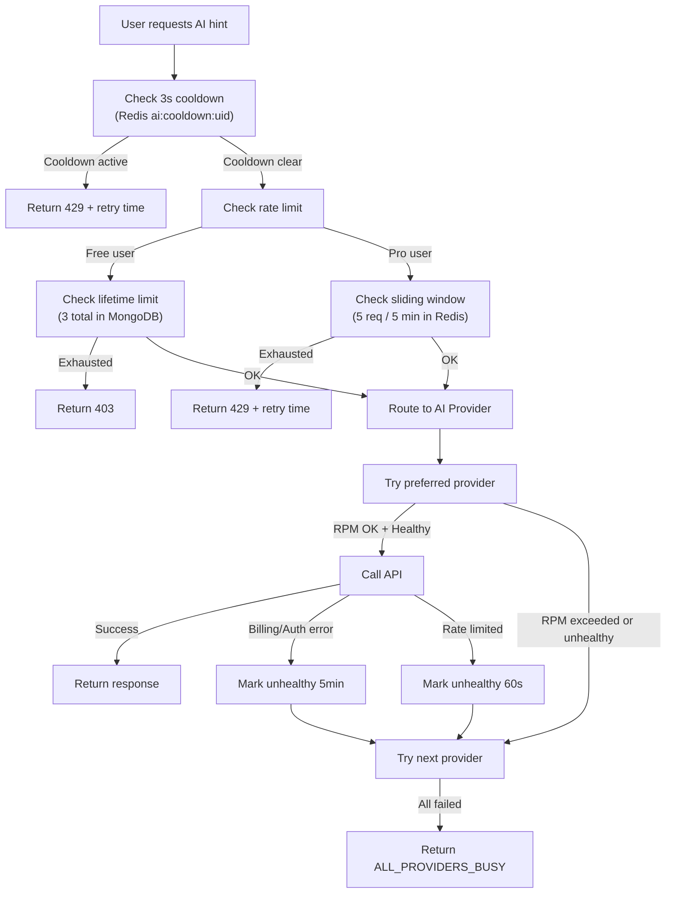

### Redis Keys for AI

```
ai:cooldown:{uid}        → 3s TTL (prevents rapid requests)
ai:ratelimit:{uid}       → Sorted Set (sliding window 5min)
ai:rpm:{provider}         → Counter with 60s TTL
ai:error:{provider}       → Error flag with 60-300s TTL
```

---

## 🔐 Authentication & Security

### Authentication Architecture

CodeHub uses a **hybrid authentication system**:

| Component | Technology | Purpose |
|---|---|---|
| **User Auth** | Firebase Authentication | Google OAuth + Email/Password login |
| **Admin Auth** | Custom JWT + OTP | Separate admin system with 2FA |

### User Authentication Flow

1. User logs in via **Firebase** (Google OAuth or email/password)
2. Frontend sends Firebase UID to backend via `POST /api/users/sync`
3. Backend creates/updates MongoDB user document
4. `AuthContext` stores user data for the React app

### Admin Authentication Flow

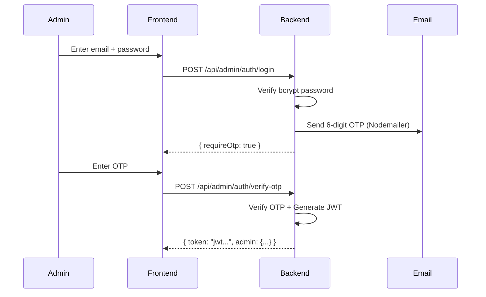

### Security Measures

| Feature | Implementation |
|---|---|
| **Helmet.js** | Secure HTTP headers (XSS protection, CSP, etc.) |
| **CORS** | Configured with credentials support |
| **Rate Limiting** | 5,000 req/15min (general), 1,000 req/hr (strict) |
| **CSRF Protection** | Token-based for admin routes (production) |
| **IP Whitelisting** | Optional admin IP restriction (`ADMIN_IP_WHITELIST`) |
| **JWT Authentication** | Short-lived tokens for admin sessions |
| **bcrypt Hashing** | Admin passwords hashed with bcrypt |
| **Webhook Verification** | HMAC-SHA256 signature checking for Razorpay |
| **OTP 2FA** | 6-digit OTP with 5-minute expiry for admin login |
| **Audit Logging** | All admin actions logged with [AuditService](file:///c:/Users/prudh/OneDrive/Desktop/CodeHub/CodeHub/server/src/services/auditService.js#3-21) |
| **x-powered-by Disabled** | `app.disable("x-powered-by")` prevents tech fingerprinting |

---

## 💳 Payment System (Razorpay)

### Payment Flow

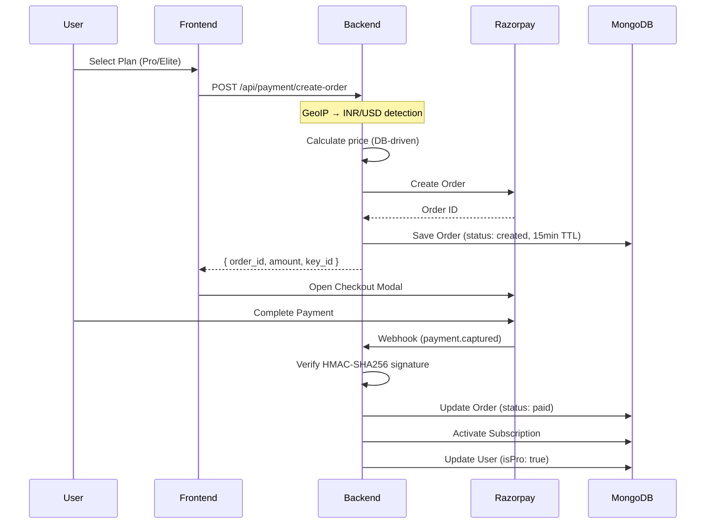

### Pricing System

| Feature | Details |
|---|---|
| **Plans** | Free, Pro, Elite |
| **Billing Cycles** | Monthly & Yearly |
| **Currencies** | INR (India), USD (International) |
| **Currency Detection** | Automatic via GeoIP (`geoip-lite`) |
| **Price Source** | Database-driven (Plan model), admin-adjustable |
| **Order Expiry** | 15-minute TTL (MongoDB TTL index auto-deletes unpaid orders) |
| **Webhook Security** | HMAC-SHA256 signature verification |

---

## 📜 Certificate Generation

### How Certificates Work

```mermaid
graph LR
    A["User completes ≥75% DSA roadmap"] --> B["POST /api/certificates/generate"]
    B --> C["Generate unique ID<br/>(CHX-DSA-XXXXXXXX)"]
    C --> D["Generate QR Code<br/>(links to verification URL)"]
    D --> E["Read HTML template"]
    E --> F["Embed images as base64"]
    F --> G["Render with Puppeteer"]
    G --> H["Generate PDF in-memory"]
    H --> I["Stream PDF to client"]
```

| Component | Technology |
|---|---|
| **PDF Engine** | Puppeteer (headless Chrome) |
| **QR Codes** | `qrcode` library |
| **Template** | HTML with placeholders (`{{NAME}}`, `{{CERTIFICATE_ID}}`, etc.) |
| **ID Format** | `CHX-DSA-XXXXXXXX` (UUID-based) |
| **Verification** | `GET /api/certificates/verify/:certificateId` |
| **Storage** | Generated in-memory (no file system storage) |
| **Idempotent** | Same certificate ID reused on re-generation |

---

## 🏢 Company Preparation Module

### Supported Companies

| Company | Sections Available |
|---|---|
| **TCS** | Aptitude, Verbal, Coding |
| **Infosys** | Aptitude, Verbal, Coding |
| **Wipro** | Aptitude, Verbal, Coding |

### Question Types

| Type | Structure |
|---|---|
| **MCQ** | Single question with 4 options (A/B/C/D), correct answer, explanation |
| **Passage Group** | Reading comprehension with a passage + multiple sub-questions |

### Progress Tracking

User progress is stored per company/section in the `User.companyPrep` map:

```javascript
companyPrep: {
    "tcs.aptitude": {
        answeredIds: ["q1", "q2"],    // Never shown again
        correctIds: ["q1"],            // Answered correctly
        skippedIds: ["q3"],            // Shown again later
        lastPracticed: "2026-03-15"
    }
}
```

### Features
- **No-repeat filtering** — answered questions are never shown again
- **Skipped questions** return at the end of a session
- **Difficulty levels** — Easy, Medium, Hard
- **Priority levels** — Very High, High, Medium, Low
- **Time limits** per question (default 90s)
- **Formula hints** — collapsible one-line hints
- **Explanations** — step-by-step solutions
- **Topic-based organization** (percentages, profit-loss, etc.)

---

## 🛡 Admin Panel

### Admin Features

| Module | Description |
|---|---|
| **Dashboard** | Platform overview & stats |
| **Users Management** | View, edit, promote, ban users |
| **Problems** | Full CRUD for coding problems (with JSON import) |
| **Company Questions** | Full CRUD for MCQ questions |
| **Payments** | View payment history and order status |
| **Announcements** | Create/manage platform-wide banners |
| **Categories** | Manage problem categories |
| **Settings** | Platform maintenance mode toggle |
| **Pricing** | Manage subscription plan pricing |

### Admin Security Layers

```
IP Whitelist → CSRF Token → JWT Token → Admin Role Check → Route Handler → Audit Log
```

1. **IP Whitelisting** (optional, via `ADMIN_IP_WHITELIST`)
2. **CSRF Protection** (cookie-based token in production)
3. **JWT Bearer Token** (signed with `ADMIN_JWT_SECRET`)
4. **Role Verification** (`admin` or `super_admin`)
5. **Audit Trail** (every admin action logged)

---

## 🚢 Deployment & DevOps

### Deployment Architecture

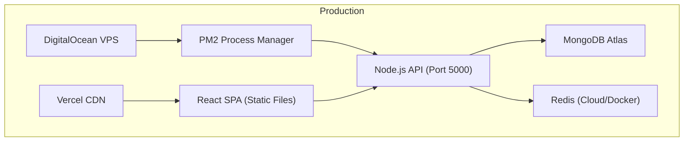

### Deployment Options

| Component | Hosting | Details |
|---|---|---|
| **Frontend** | Vercel | Auto-deploy from Git, SPA routing via [vercel.json](file:///c:/Users/prudh/OneDrive/Desktop/CodeHub/CodeHub/vercel.json) |
| **Backend** | DigitalOcean | VPS with PM2, deploy via [deploy.sh](file:///c:/Users/prudh/OneDrive/Desktop/CodeHub/CodeHub/server/deploy.sh) |
| **Backend (Alt)** | Render | Free tier in Singapore region ([render.yaml](file:///c:/Users/prudh/OneDrive/Desktop/CodeHub/CodeHub/render.yaml)) |
| **Database** | MongoDB Atlas | Cloud-hosted MongoDB |
| **Docker** | Docker Compose | Full-stack local/production deployment |

### PM2 Configuration

```javascript
// ecosystem.config.js
{
    name: 'codehubx-api',
    script: 'src/server.js',
    instances: 1,
    autorestart: true,
    watch: false,
    env_production: {
        NODE_ENV: 'production'
    }
}
```

### Deployment Script ([deploy.sh](file:///c:/Users/prudh/OneDrive/Desktop/CodeHub/CodeHub/server/deploy.sh))

```bash
#!/bin/bash
export NVM_DIR="$HOME/.nvm"
[ -s "$NVM_DIR/nvm.sh" ] && . "$NVM_DIR/nvm.sh"
cd /root/codehubx-server
npm install --production
pm2 startOrRestart ecosystem.config.js --env production
pm2 save
pm2 list
```

---

## 📡 API Routes Reference

### Public Routes

| Method | Route | Description |
|---|---|---|
| `GET` | `/api/health` | Health check |
| `GET` | `/api/platform` | Platform settings (maintenance mode, etc.) |
| `GET` | `/api/announcements/active` | Active announcements |
| `GET` | `/api/certificates/verify/:id` | Certificate verification |

### User Routes (`/api/users`)

| Method | Route | Description |
|---|---|---|
| `POST` | `/api/users/sync` | Create/update user from Firebase auth |
| `GET` | `/api/users/:uid` | Get user profile |
| `GET` | `/api/users/handle/:username` | Get user by username |
| `PUT` | `/api/users/:uid/profile` | Update profile |
| `GET` | `/api/users/leaderboard` | Global leaderboard |

### Execution Routes (`/api/execute`)

| Method | Route | Description |
|---|---|---|
| `POST` | `/api/execute/run` | Run code with stdin |
| `POST` | `/api/execute/submit` | Submit code for grading |
| `GET` | `/api/execute/submission/:problemId` | Get latest submission |

### Problem Routes (`/api/problems`)

| Method | Route | Description |
|---|---|---|
| `GET` | `/api/problems` | List all problems |
| `GET` | `/api/problems/:id` | Get problem by ID |

### AI Routes (`/api/ai`)

| Method | Route | Description |
|---|---|---|
| `POST` | `/api/ai/hint` | Get AI-powered hint |
| `GET` | `/api/ai/providers` | List healthy AI providers |

### Payment Routes (`/api/payment`)

| Method | Route | Description |
|---|---|---|
| `POST` | `/api/payment/create-order` | Create Razorpay order |
| `GET` | `/api/payment/pricing` | Get pricing data |
| `POST` | `/api/webhooks/razorpay` | Payment webhook |

### Admin Routes (`/api/admin`)

| Method | Route | Description |
|---|---|---|
| `POST` | `/api/admin/auth/login` | Admin login |
| `POST` | `/api/admin/auth/verify-otp` | Verify admin OTP |
| `*` | `/api/admin/*` | Full CRUD for problems, users, announcements, etc. |
| `*` | `/api/admin/pricing/*` | Plan pricing management |

### Company Questions (`/api/company-questions`)

| Method | Route | Description |
|---|---|---|
| `GET` | `/api/company-questions/:company/:section/:topic` | Get questions by company/topic |

### Certificate Routes (`/api/certificates`)

| Method | Route | Description |
|---|---|---|
| `POST` | `/api/certificates/generate` | Generate PDF certificate |
| `GET` | `/api/certificates/verify/:id` | Verify certificate |

---

## 🔑 Environment Variables

### Frontend ([.env.local](file:///c:/Users/prudh/OneDrive/Desktop/CodeHub/CodeHub/.env.local))

| Variable | Description |
|---|---|
| `VITE_FIREBASE_API_KEY` | Firebase Web API key |
| `VITE_FIREBASE_AUTH_DOMAIN` | Firebase auth domain |
| `VITE_FIREBASE_PROJECT_ID` | Firebase project ID |
| `VITE_FIREBASE_STORAGE_BUCKET` | Firebase storage bucket |
| `VITE_FIREBASE_MESSAGING_SENDER_ID` | Firebase messaging ID |
| `VITE_FIREBASE_APP_ID` | Firebase app ID |
| `VITE_FIREBASE_MEASUREMENT_ID` | Firebase analytics ID |

### Backend ([server/.env](file:///c:/Users/prudh/OneDrive/Desktop/CodeHub/CodeHub/server/.env))

| Variable | Description |
|---|---|
| `MONGO_URI` | MongoDB connection string |
| `PORT` | API server port (default: 5000) |
| `REDIS_URL` | Redis connection URL (optional, uses MockRedis if not set) |
| `NVIDIA_API_KEY` | NVIDIA NIM API key |
| `GEMINI_API_KEY` | Google Gemini API key |
| `CLAUDE_API_KEY` | Anthropic Claude API key |
| `DEEPSEEK_API_KEY` | DeepSeek API key |
| `RAZORPAY_KEY_ID` | Razorpay public key |
| `RAZORPAY_KEY_SECRET` | Razorpay secret key |
| `RAZORPAY_PLAN_ID` | Razorpay plan identifier |
| `RAZORPAY_WEBHOOK_SECRET` | Razorpay webhook signature secret |
| `ADMIN_JWT_SECRET` | JWT signing secret for admin tokens |
| `ADMIN_PROMOTE_CODE` | Code to promote user to admin |
| `PRO_PROMOTE_CODE` | Code to promote user to pro |
| `ADMIN_IP_WHITELIST` | Comma-separated allowed admin IPs |
| `SMTP_HOST` | SMTP server host |
| `SMTP_PORT` | SMTP port (default: 587) |
| `SMTP_SECURE` | Use TLS (true/false) |
| `SMTP_USER` | SMTP username |
| `SMTP_PASS` | SMTP password (Google App Password) |
| `SMTP_FROM` | Sender email address |
| `INITIAL_ADMIN_EMAIL` | First admin user email |

---

## ✨ Key Features Summary

### For Students/Users

| Feature | Description |
|---|---|
| 🖥️ **Online Code Editor** | Monaco Editor (VS Code engine) with 4 language support |
| 📚 **DSA Problem Sets** | Structured problems by topic and difficulty |
| 🗺️ **DSA Roadmap** | Guided 30-day learning path with locked/unlocked progression |
| 🏢 **Company Prep** | MCQ practice for TCS, Infosys, Wipro (Aptitude, Verbal, Coding) |
| 🤖 **AI Hints** | Multi-provider AI explanations (NVIDIA, Gemini, DeepSeek, Claude) |
| 🏆 **Leaderboard** | Global ranking by solved problems |
| 📊 **Dashboard** | Personal stats (streak, solved, time, rank) |
| 🔥 **Streaks** | Daily solving streak tracking |
| 📜 **Certificates** | PDF certificates with QR verification (≥75% roadmap completion) |
| 👤 **Public Profiles** | Custom usernames, social links, skill tags |
| 📝 **Submission History** | Track all past submissions (capped at 2000) |
| 📱 **Responsive Design** | Mobile-optimized with motion reduction |
| 📰 **Articles** | Tech articles and learning content |
| 🎨 **Dark Theme** | Premium dark UI throughout |
| 🔔 **Announcements** | Platform-wide announcement banners |

### For Admins

| Feature | Description |
|---|---|
| 🔒 **Secure Admin Login** | 2FA with OTP + JWT + IP whitelist + CSRF |
| 📋 **Problem Management** | Full CRUD with JSON import for editorials (brute + optimal solutions) |
| ❓ **Question Management** | Company question CRUD with passage groups and MCQs |
| 👥 **User Management** | View, edit, promote, ban users |
| 💰 **Payment Dashboard** | Order tracking and payment status |
| 📢 **Announcements** | Targeted banners (all/free/pro/elite audiences) |
| 🛠️ **Maintenance Mode** | One-click platform shutdown |
| 💲 **Dynamic Pricing** | Admin-configurable plans with INR + USD support |
| 📊 **Audit Logs** | Complete trail of all admin actions |

### Technical Highlights

| Feature | Technology |
|---|---|
| ⚡ **Redis Caching** | Response caching, AI rate limiting, provider health tracking |
| 🐳 **Docker** | Multi-service containerization (web, api, worker, redis) |
| 📦 **Job Queue** | Bull + Redis for code submission processing |
| 🔄 **AI Failover** | Automatic failover across 4 AI providers with health monitoring |
| 🌍 **Geo-Pricing** | Auto-detect Indian/International users for INR/USD pricing |
| 🏗️ **Multi-Stage Docker** | Minimal production images via build → serve pattern |
| 🔒 **Security** | Helmet, CORS, rate limiting, CSRF, JWT, bcrypt, webhook HMAC |
| 📈 **Auto-Scaling Ready** | PM2 process management, Docker worker separation |
| 🗑️ **Auto-Cleanup** | MongoDB TTL indexes for expired orders |
| 🎯 **Batch Execution** | Single Judge0 call for all test cases (4x speed improvement) |
| 🧩 **Code Splitting** | React lazy loading for all pages |
| 🔄 **Graceful Fallback** | MockRedis when Redis unavailable, SMTP fallback to console |

---

> [!NOTE]
> This documentation reflects the current state of the CodeHub codebase as of **March 2026**. The platform is actively under development with continuous feature additions and optimizations.
